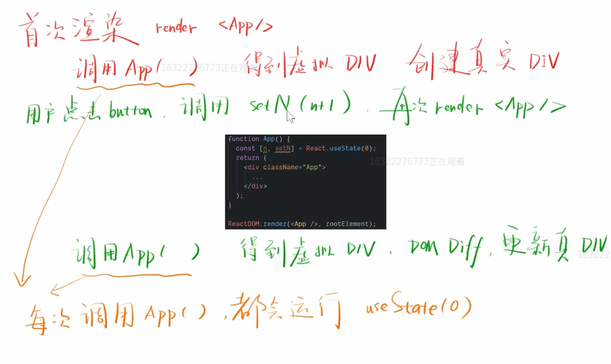
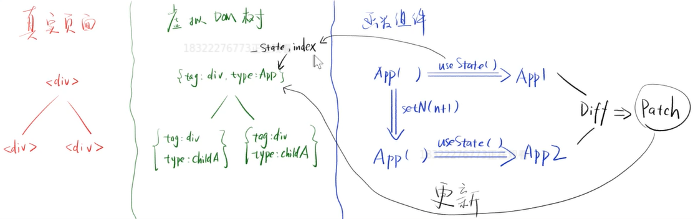

# React Hooks 原理解析

## useState 原理

### 示例 

```jsx harmony
import React from 'react'
import ReactDOM from 'react-dom'
const rootElement = document.getElementById('root')

function App(){
  const [n,setN] = React.useState(0)
  return (
    <div className='App'>
      <p>{n}</p>
      <p>
        <button onClick={()=>setN(n+1)}>+1</button>
      </p>
    </div>
  )
}

ReactDOM.render(<App/>, rootElement)
```



### 分析

- setN 
    - 一定会修改数据 x, 将 n+1 存入 x
    - 一定会触发 <App/> 重新渲染 (re-render)
- useState
    - 肯定会从 x 读取 n 的最新值
- x 
    每个组件都有自己的数据 x, 我出门将其命名为 state

### 实现简单的 useState


```jsx harmony
import React from 'react'
import ReactDOM from 'react-dom'
const rootElement = document.getElementById('root')

let _state
const myUseState = initialValue => {
  _state = _state === undefined ? initialValue : _state
  const setState = newValue => {
    _state = newValue
    render()
  } 
  return [_state,setState]
}

const render = () => {
  ReactDOM.render(<App/>, rootElement)
}

function App(){
  const [n,setN] = myUseState(0)
  return (
    <div className='App'>
      <p>{n}</p>
      <p>
        <button onClick={()=>setN(n+1)}>+1</button>
      </p>
    </div>
  )
}
```

:::tip 注意 
如果有两个数据要渲染那就行不通了

改进代码如下, 可以加一个数组, 把当前的索引记下, 然后根据顺序渲染
:::

```jsx harmony
import React from "react";
import ReactDOM from "react-dom";
const rootElement = document.getElementById('root')

let _state = []
let index = 0
const myUseState = initialValue => {
  const currentIndex = index

  _state[currentIndex] = _state[currentIndex] === undefined ? initialValue : _state[currentIndex]
  const setState = newValue => {
    _state[currentIndex] = newValue
    render()
  } 
  index += 1
  return [_state[currentIndex],setState]
}

const render = () => {
  index = 0
  ReactDOM.render(<App/>, rootElement)
}

function App(){
  const [n,setN] = myUseState(0)
  const [m,setM] = myUseState(0)
  return (
    <div className='App'>
      <p>{n}</p>
      <p>
        <button onClick={()=>setN(n+1)}>+1</button>
      </p>
      <p>{m}</p>
      <p>
        <button onClick={()=>setM(m+1)}>+1</button>
      </p>
    </div>
  )
}

ReactDOM.render(<App/>, rootElement)
```

:::danger 危险
因为 _state 是数组, 所以他的顺序很重要, 如果用 if else 来判断条件加入 useState, 那么会导致顺序错误的 bug
所以 React useState 不能让 if else 判断
:::

#### _state 和 index 可能会重名

- 把 _state 和 index 放在虚拟 DOM 对象上, 这样每个组件都有自己的 _state 和 index


### 总结 

- 每个函数组件对应一个 React 节点
- 每个节点保存着 state 和 index
- useState 会读取 state[index]
- index 由 useState 出现的顺序决定
- setState 会修改 state, 并触发更新
- 每次渲染时 n 都是一个新的数, 函数式编程的特点



### 拓展

- 如何解决 React 中 n 的分身?
    - 全局变量 window
    - useRef 不仅可以用于 div, 还能用于任何数据
    - useContext 不仅能贯穿始终, 还能贯穿不同组件