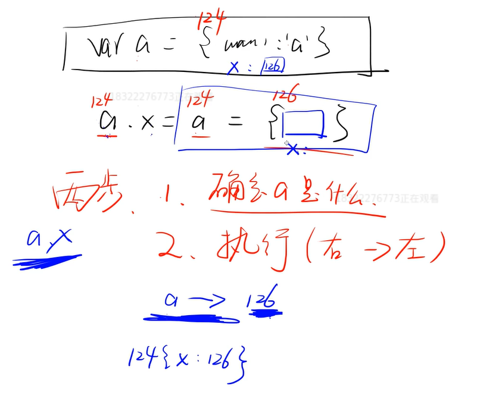

# 开放题和刁钻题

## 什么是 XSS? 如何预防?

含义: XSS(Cross Site Scripting), 即跨站脚本攻击, 是一种常见于web应用程序中的计算机安全漏洞

预防: 只要我们使用HTML编码将浏览器需要渲染的信息编码后, 浏览器在渲染DOM元素的时候, 会自动解码需要渲染的信息, 将上述信息解析成字符串而不是JS脚本, 这就是我们防御XSS攻击的核心想法
    
- 获取用户的输入, 不用innerHtml,用innerText
- 对用户的输入进行过滤, 如对& < > " ' /等进行转义
    
## 什么是 CSRF? 如何预防?

含义:  CSRF (Cross Site Request Forgery), 跨站请求伪造, 是利用后台有规律的接口，例如 localhost/deleteAriticle.php?id=3&username=xiaoxiao ，攻击者在被攻击的网站页面嵌入这样的代码，当用户xiaoxiao访问该网站的时候，会发起这条请求。服务器会删除id为3的数据

预防:
 
- 客户端: 对于数据库的修改请求, 全部使用POST提交, 禁止使用GET请求
- 服务端: 一般的做法是在表单里面添加一段隐藏的唯一的token(请求令牌)

## 你遇到最难的问题? 

开放性问题, 讲究一波三折

举个例子:
:::tip 注意 例子1
做 PointUI 的轮子时, 单元测试配置 karma.config 时一直打不开浏览器进行测试, 
该开始从网上搜了解决方案, 试了都不成功, 重写下载了 node_modules 好几次, 还是不行, 后来找答案到想放弃写单元测试了, 然后纠结了半天,
还是继续在网上找答案, 因为单元测试会为以后的代码重构打很好的基础, 后来经过好几次的排错, 终于在 Stack Overflow 上找出了正解
:::

:::tip 注意 例子2
在做小猫记账的时候, 做统计页面引入 Echarts, 后来在数据动态变化的时候 Echarts 一直渲染不成功, 后来以为是钩子函数的问题, 换了好几次钩子函数, 
还是不行, 网上搜了一些方法也没有作用, 后来突然有了灵感, 是不是 Echarts 的问题, 后来网上尝试着搜了一下, 确实有 Echarts 的及时渲染问题, 所以我靠这个解决了统计页面的 Echart 渲染问题
:::

## 你在团队的突出贡献是什么?

- 目前还是学生, 所有项目都是自己开发

## 最近关注什么新技术? 

- 多看 阮一峰 尤雨溪 还有其他的前端大佬

## 有没有看过一些源码, 看了之后有什么记忆深刻的地方, 有什么收获?

- 这个问题等看了源码会写

## 刁钻题目(其实就是 JS 的 bug)

### 代码
```js
[1,2,3].map(parseInt) // 1 NaN NaN
```
:::danger 危险
具体步骤是这样的, 所以会出现上述结果

parInt('1',0)

parInt('2',1)

parInt('3',2)
:::

### 代码
```js
var a = {name: 'a'}
a.x = a = {}
// a.x = undefined 
```


### (a ==1 && a== 2 && a==3) 可能为 true 吗？

- 利用 == (两个等于号, 两头参数不一样的话就会自动调用 valueOf 方法)会调用 valueOf() 的特性

```js
let a = {
 value: 1,
 valueOf(){
   return this.value++
 }
}
a == 1 && a == 2 && a == 3 // true
```

- 利用 a 会读取 window.a 的特性

```js
var value = 1; 
Object.defineProperty(window, 'a', {
 get(){
     return value++;
 }
})
a ==1 && a== 2 && a==3 // true
// 或者 
a ===1 && a=== 2 && a===3 // true
```

## 超纲题

### JS 垃圾回收

- 什么是垃圾
    - 
- 如何捡垃圾
    - 
- 前端又有其特殊性
    -  
