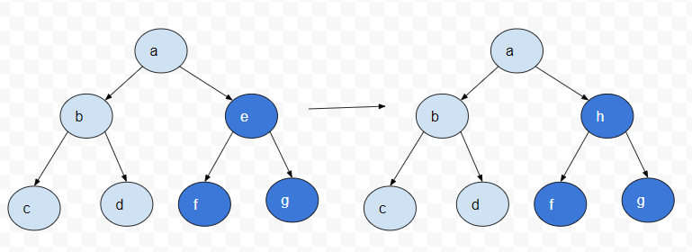
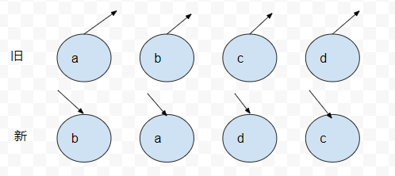

# React 技巧

## 受控组件与非受控组件

```jsx harmony
<FInput value={x} onChange={fn}/> // 受控组件
<FInput defaultValue={x} ref={input}/> // 非受控组件
```

> 受控组件: 输入的值始终都由 React 的 state 驱动

```jsx harmony
import { useState } from 'react'
const controlComponent = () => {
  const [inputValue, setInputValue] = useState('')
  const handleChange = (e) => {
    setInputValue(e.target.value)
  }
  return (
    <div>
      <label>
        <input type='text' value={inputValue} onChange={handleChange} />
      </label>
    </div>
  )
}
```

input 的值始终都是通过 inputValue 来控制

> 非受控组件: 表单数据将由 DOM 节点来处理

```jsx harmony
import React, { useState } from 'react'
const uncontrolComponent = () => {
  const [inputValue, setInputValue] = useState(React.createRef())
  const handleSubmit = (e) => {
    console.log(inputValue.current.value)
    e.preventDefault()
  }
  return (
    <form onSubmit={handleSubmit}>
      <label>
        <input type='text' value={inputValue} ref={inputValue} />
      </label>
    </form>
  )
}
```

因为非受控组件将真实数据存在 DOM 节点中, 所以使用非受控组件时, 有时候反而容易同时集成 React 和非 React 代码, 如果
不介意代码美观性, 并且希望快速编写代码, 使用非受控组件能减少代码量, 否则该使用受控组件

区别:

- 受控组件的状态由开发者维护
- 非受控组件的状态由组件自身维护(不受开发者控制)

## React 有哪些生命周期函数? 分别有什么用? (Ajax 请求放在哪个阶段)

- componentDidMount
- componentDidUpdate
- shouldComponentUpdate
- componentDidUnmount

ajax 放在 componentDidMount

## React 如何实现组件通信?

- 父子靠 props
- 爷孙靠两次 props
- 任意组件靠 Redux(Hooks)

## shouldComponentUpdate 有什么用?

- 用于没有在必要更新 UI 的时候返回 false

## 什么是高阶组件?

高阶组件(HOC)是接收一个组件并返回一个新组件的函数, 基本上, 这是一个模式, 是从 React 的组合特性中衍生出来的, 称其为纯组件
, 因为他们可以接受任何动态提供的组件, 但不会修改或复制输入组件中的任何行为

```jsx harmony
const EnhancedComponent = higherOrderComponent(WrapperedComponent)
```

::: tip 注意
HOC 可用于一下许多用例:

1. 代码重用, 逻辑和引导抽象
2. 渲染劫持
3. state 抽象和操作
4. props 处理
   :::

## 什么是 prop drilling, 如何避免

构建 React 程序时, 多层嵌套组件来使用另一个嵌套组件提供的数据, 最简单的方法是将一个 prop 从每个组件一层一层的传递下去, 从元组件
传递到深层嵌套组件, 叫做 prop drilling

解决方法可以使用 React Context 通过定义 provider 组件, 并允许通过 Consumer 或 useContext Hook 使用上下文

## 什么是 React Fiber

是 React 16 中新的协调引擎或重新实现核心算法, 主要目标是支出虚拟 DOM 的增量渲染, React Fiber 在于提高在其动画, 布局, 手势,
暂停, 终止或重用等方面的适用性, 并为不同类型的更新分配优先级, 以及新的并发原语

## React diff 的原理是什么?

> diff 策略

1. Web UI 中 DOM 节点跨层级的移动操作特别少，可以忽略不计。
2. 拥有相同类的两个组件将会生成相似的树形结构，拥有不同类的两个组件将会生成不同的树形结构。
3. 对于同一层级的一组子节点，它们可以通过唯一 id 进行区分。

以上三个策略, React 分别对 tree diff, component diff 和 element diff 进行算法优化, 事实也证明这三个提前策略是
喝了且准确的, 他保证了整体界面建构的性能

> tree diff

基于策略一, React 对树的算法进行了简明的优化, 对树进行分层比较, 两棵树只会对同一层次的节点进行比较

基于 DOM 节点跨层级的移动可以少到忽略不计, React 通过 updateDepth 对 Virtual DOM 树进行层级控制, 当发现节点不存在, 那么该节点和其子节点就会删除, 不会用于进一步比较
, 不会用于进一步的比较, 这样只需要对树进行一次遍历, 便能完成整个 DOM 树的比较

```js
// 源码
updateChildren: function (nextNestedChildrenElements,transaction,context) {
  updateDepth++
  let errorThrown = true
  try{
    this._updateChildren(nextNestedChildrenElements,transaction,context)
    errorThrown = false
  }finally {
    updateDepth--
    if(!updateDepth){
      if(errorThrown){
        clearQueue()
      }else{
        processQueue()
      }
    }
  }

}
```

那如果出现了跨层级的操作, diff 会怎样表现


我们让上图的 a 节点包括其子节点移动到 d 节点下, React 会怎样操作

由于 React 只考虑简单的同层节点操作, 对于不同层级的只能删除和创建, 所以当根节点发现 a 消失了, 就会删除 a, 再在
d 节点下方创建 a 节点, 在创建 a 的子节点 b 和 c

:::tip 注意
所以当出现跨级移动时, 并不会像想象中的那样移动, 会先删除在创建, 所以官方不建议进行 DOM 节点的跨层级操作
:::

> component diff

React 是基于组件构建应用的, 对于组件间的比较所采取的策略也是简介高效

- 如果同一类型组件, 安装原策略比较 Virtual DOM tree
- 如果不是, 则将该组件判断为 dirty component, 从而替换整个组件下所有节点
- 对于同一类型组件, 有可能 Virtual DOM 没有任何变化, 如果确切知道这点可以节省大量的 diff 运算时间, 因此 React 允许
  用户通过 shouldComponentUpdate 来判断该组件是否需要 diff



当 e 组件变成 h 时, React 就不会比较这两个组件结构, 直接进行删除组件 e, 重写创建 h 及子组件, 虽然两个组件时不同类型结构类似,
dif 算法会影响性能, 正如博客所言

**不同类型的组件很少存在相似 DOM 数的情况, 因此, 这种极端因素很难在实际开发过程中造成重大影响**

> element diff

当节点处于同一层级, React diff 提供了三种节点操作, 分别为, INSERT_MARKUP(插入), MOVE_EXISTING(移动) 和 REMOVE_NODE(删除)

- INSERT_MARKUP: 新的 component 类型不在老集合里, 即要对新节点执行插入
- MOVE_EXISTING: 在老集合里有新 component 类型, 且 element 是可更新的类型, generateComponentChildren 已调用 receiveComponent, 这种情况下
  pervChild = nextChild, 就需要移动操作, 可以复用以前的 DOM 节点
- REMOVE_NODE: 在老 component 类型, 在新集合里有, 但对应的 element 不同贼不能直接复用和更新, 需要执行删除操作, 或者老 component 不在新集合里的, 也要执行删除操作

```js
// element diff 源码
// INSERT_MARKUP
function makeInsertMarkup(markup, afterNode, toIndex) {
  return {
    type: ReactMultiChildUpdateTypes.INSERT_MARKUP,
    content: markup,
    fromIndex: null,
    fromNode: null,
    toIndex: toIndex,
    afterNode: afterNode,
  }
}
// MOVE_EXISTING
function makeMove(child, afterNode, toIndex) {
  return {
    type: ReactMultiChildUpdateTypes.MOVE_EXISTING,
    content: null,
    fromIndex: child._mountIndex,
    fromNode: ReactReconciler.getNativeNode(child),
    toIndex: toIndex,
    afterNode: afterNode,
  }
}
// REMOVE_NODE
function makeRemove(child, node) {
  return {
    type: ReactMultiChildUpdateTypes.REMOVE_NODE,
    content: null,
    fromIndex: child._mountIndex,
    fromNode: node,
    toIndex: null,
    afterNode: null,
  }
}
```

举个例子加深印象



旧集合 a,b,c,d 四个节点, 更新后新集合为 b,a,c,d 节点, 依次对比, 依次删除在创建

React 发现这样太繁琐, 因为只是节点位置发生变化而已, 所以没必要删除在创建, 只需移动下位置即可

**所以 React 针对同一层级的同组节点, 添加唯一 key 进行区分, 虽然只是小小的改动, 但性能上提高了很多**

## Redux 是什么?

Redux 是 JavaScript 状态容器, 提供可预测化的状态管理, 重点是状态管理

- action: 数据从应用传到 store 的有效载体, 一般来说会通过 store.dispatch() 传入
- reducer: 制定了应用状态的变化如何响应 actions 并发送到 store 的, 就相当于对 actions 的描述
- store: 把 actions reducer 连到一起的对象
  - getState(): 获取 state
  - dispatch(action) 更新 state
  - subscribe(listener) 注册监听器
  - subscribe(listener) 返回的函数注销监听器
  - store 只有一个, 如果分析处理逻辑, 使用 reducer
- 单向数据流: 所有的数据都遵循相同的生命周期, 这样可以让应用变得更加可控, 避免使用多个重复数据

## connect 的原理是什么?

react-redux 提供的一个 api, connect 的作用是把组件和 store 连接起来, 产生一个新的组件, connect 是高阶组件

provider 可以让你整个 app 访问到 redux store 的数据

## React 的 setState 什么时候是同步的, 什么时候是异步的

React 中, 如果是由 React 引发的事件处理(通过 onClick 等引发的事件处理), 调用 setState 不会同步更新 this.state,
除此之外的 setState 调用会同步执行 this.state, 所谓除此之外, 指的是绕过 React 通过 addEventListener 直接添加
事件处理函数, 还有通过 setTimeout 和 setInterval 产生的异步调用

> 原因: 在 React 的 setState 函数实现中, 会根据一个变量 isBatchingUpdates 判断是直接更新 this.state 还是放到队列中
> 回头再说, 而 isBatchingUpdates 默认为 false, 也便是 setState 会同步更新 this.state, 但是有一个函数 batchedUpdates,
> 这个函数会把 isBatchingUpdate 修改为 true, 而当 React 在调用事件处理之前就会调用这个 batchedUpdates, 造成的后果, 就是有 React 控制
> 的时间处理过程 setState 不会同步更新 this.state

:::tip 注意
setState 的`异步`并不是说内部由异步代码实现, 其实本身执行的过程和代码都是同步的, 只是合成事件和钩子函数的调用顺序在
更新之前, 导致在合成事件和钩子函数中没发立马拿到更新后的值, 形成了所谓的`异步`, 当然可以通过第二个参数 setState(partialState,callback) 中
的 callback 拿到更新后的结果
:::

## Virtual DOM 真的比原生 DOM 快么?

[这个回答可以说是无懈可击了](https://github.com/Advanced-Frontend/Daily-Interview-Question/issues/47)

## Redux 为什么要把 reducer 设计成纯函数

redux 三大原则:

1. 单一数据流, 整个应用 state 都被存储在一个 store 里面, 构成一个 Object tree
2. State 是只读的, 唯一改变 state 的方法就是触发 action, action 是一个用于描述已发生事件的普通对象
3. 使用纯函数来执行修改, 为了描述 action 如何修改 state tree, 你需要编写 reducers, 把 reducer 设计成纯函数,
   可以实现时间旅行, 记录/回放或热加载

## React-router 里的 <link> 标签和 <a> 标签有什么区别

link 源码

```jsx harmony
if (_this.props.onClick) _this.props.onClick(event)

if (
  !event.defaultPrevented && // onClick prevented default
  event.button === 0 && // ignore everything but left clicks
  !_this.props.target && // let browser handle "target=_blank" etc.
  !isModifiedEvent(event) // ignore clicks with modifier keys
) {
  event.preventDefault()

  var history = _this.context.router.history
  var _this$props = _this.props,
    replace = _this$props.replace,
    to = _this$props.to

  if (replace) {
    history.replace(to)
  } else {
    history.push(to)
  }
}
```

1. 有 onclick 就执行 onclick
2. click 的时候阻止 a 标签默认事件
3. 再取得跳转 href, 用 history 跳转, 此时只是链接变了, 并没有刷新页面

## React 16 更新的生命周期

废弃生命周期:

- componentWillMount
- componentWillReceiveProps
- componentWillUpdate

虽被废弃但没被删除, 为了向下兼容

react 声明周期分三阶段, 挂载阶段, 更新阶段, 卸载阶段

### 挂载阶段

- constructor: 构造函数, 最先被执行, 通常在构造函数里初始化 state 对象和给自定义方法绑定 this
- static getDerivedStateFromProps: 这个静态方法用于当接收新的属性去修改 state
- render: 一个纯函数, 只返回需要渲染的东西, 不应该包含其他的业务逻辑
- componentDidMount: 组件装载之后调用, 可以获取 DOM 节点后操作, canvas, svg 的操作, 服务器请求, 订阅都可写在这里

### 更新阶段

- getDerivedStateFromProps: 此方法在更新挂载阶段都会调用
- shouldComponentUpdate: 两个参数, nextProps, nextState, 新的属性和变化之后的 state, 返回一个布尔值, true 表示触发渲染,
  false 表示不会触发渲染, 默认返回 true
- render: 更新阶段也会触发
- getSnapshotBeforeUpdate: 在 render 之后, componentDidUpdate 之前调用, 有两个参数 prevProps 和 prevState, 表示之前的
  属性和之前的 state, 这个函数有一个返回值, 会作为第三个参数传给 componentDidUpdate, 必须与 componentDidUpdate 搭配使用
- componentDidUpdate: 三个参数, prevProps, prevState, snapshot, 表示之前的 props, state 和 snapshot, 如果
  触发某些回调函数需要用到 DOM 元素的状态, 则将对比或计算的过程迁移至 getSnapshotBeforeUpdate, 然后在 componentDidUpdate 中统一触发回调或更新状态

### 卸载阶段

- componentWillUnmount: 组件被卸载了或被销毁了就会调用, 在这里清除定时器, 取消网络请求等操作

## setState 到底是异步还是同步的

- 有时候表现异步, 有时候表现同步

1. 只能在合成事件和钩子函数中是异步的, 在原生事件和 setTimeout 中是同步的
2. 异步并不是说内部由异步代码实现, 其实本身执行的过程和代码都是同步的, 只是合成事件和钩子函数调用顺序在更新之前,
   导致在合成事件和钩子函数没发立马拿到更新后的值, 形成了所谓的异步, 可以通过第二给参数中的回调拿到结果
3. 批量更新优化也是异步的(合成事件, 钩子函数)之上的, 在原生事件和 setTimeout 中不会批量更新, 在异步中如果对同一个值多次 setState
   , setState 的批量更新策略会对其进行覆盖, 去最后一次执行, 如果是通过 setState 值, 在更新时会对其合并批量更新

## React 中的 refs 干嘛用的

Refs 提供了一种访问在 render 方法中创建的 DOM 节点或者 React 元素的方法, 在典型的数据流中, props 是父子组件交互的
唯一方式, 想要修改子组件, 需要使用新的 props 来渲染它, 如果想要强制修改子代, 可以用 Refs

## 在 React 中如何处理事件

为了解决兼容性问题, SyntheticEvent 实例会被传递给你的事件处理函数, SyntheticEvent 是 React 跨浏览器的原生事件包装器
, 他还拥有和浏览器原生事件相同的接口, 包括 stopPropagation 和 preventDefault

## Hooks 优缺点

优点:

1. 更容易复用代码
2. 清爽的代码风格
3. 代码量更少
4. 更容易发现无用的状态和函数, 函数组件里的 unused 状态和函数更容易发现
5. 更容易拆分组件, 自定义 Hooks

缺点:

1. 响应式的 useEffect, 处理不好容易造成死循环
2. 状态不同步, 函数运行独立, 每个函数都有一份单独作用域, 处理复杂逻辑时可能遇到状态不同步问题
