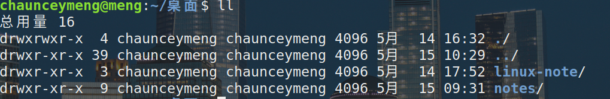
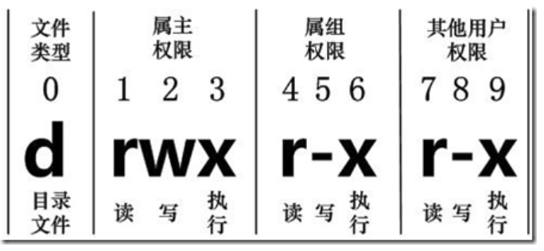

# Linux 文件基本属性

## 基本介绍

Linux 系统中有组和权限的概念，而 windows 上没有，虽然都是多用户操作系统，但是 linux 相对来说更加安全

Linux系统对不同的用户访问同一文件（包括目录文件）的权限做了不同的规定

在Linux中我们可以使用ll或者ls –l命令来显示一个文件的属性以及文件所属的用户和组



>上图显示的权限的第一个字母 `d` 表示目录，当然还有好几种类型

- `d`: 目录
- `-`: 文件
- `l`: 链接文档(link file)
- `b`: 装置文件里面的可供储存的接口设备(可随机存取装置)
- `c`: 装置文件里面的串行端口设备，例如键盘、鼠标(一次性读取装置)

>接下来的 rwx 代表分别是： **[ r ]代表可读(read)、[ w ]代表可写(write)、[ x ]代表可执行(execute)**



第4-6位确定属组（所有者的同组用户）拥有该文件的权限，第7-9位确定其他用户拥有该文件的权限

:::tip 注意
对于 root 用户来说，一般情况下，文件的权限对其不起作用
:::

## 更改文件属性

1. chgrp：更改文件属组

```shell script
chgrp [-R] 属组名 文件名
```
-R 代表改变此文件内的所有属组

2. chown：更改文件属主，也可以同时更改文件属组

```shell script
chown [–R] 属主名 文件名
chown [-R] 属主名：属组名 文件名
``` 

3. chmod：更改文件9个属性

Linux文件的基本权限就有九个，分别是owner/group/others三种身份各有自己的read/write/execute权限

>利用数字进行变更：(推荐使用这种方法，好记)
- r: 4
- w: 2
- x: 1

r + w + x = 7, 所以我们更改权限的时候就可以用以下命令

```shell script
chmod -R 770 文件或目录
```
这样就给 owner 组所有权限，给 group 所有权限， **不**给 others 任何权限


>利用字符进行变更

那么我们就可以使用 u, g, o 来代表三种身份的权限

a 则代表 all，即全部的身份。读写的权限可以写成 r, w, x

```shell script
chmod u=rwx,g=rw,o=x 文件或目录
```

如果要将其中某一个权限去掉, 如下代码，把所有的执行权限都去掉

```shell script
chmod  a-x 文件或目录
```

:::danger 危险
更改权限命令在服务器上使用要小心，以防出现安全问题
:::