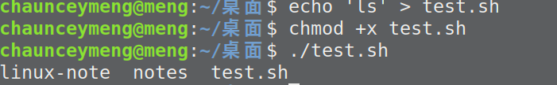
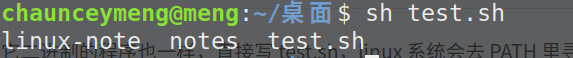

# Shell 详解

Shell 是一个用 C 语言编写的程序，它是用户使用 Linux 的桥梁

Shell 既是一种命令语言，又是一种程序设计语言

Shell 是指一种应用程序，这个应用程序提供了一个界面，用户通过这个界面访问操作系统内核的服务

Shell 不仅存在于 linux 也存在于 windows 

## Shell 脚本

Shell 脚本（shell script），是一种为 shell 编写的脚本程序

业界所说的 shell 通常都是指 shell 脚本

## Shell 环境

- Bourne Shell（/usr/bin/sh或/bin/sh）

- Bourne Again Shell（/bin/bash）(最普及而且 linux 上自带)

- C Shell（/usr/bin/csh）

- K Shell（/usr/bin/ksh）

- Shell for Root（/sbin/sh）

在一般情况下，人们并不区分 Bourne Shell 和 Bourne Again Shell，所以，像 #!/bin/sh，它同样也可以改为 #!/bin/bash

:::tip 注意
`\#!` 告诉系统其后路径所指定的程序即是解释此脚本文件的 Shell 程序
:::

## 运行 Shell 脚本有两种方法

1. 作为可执行程序

在 test.sh 直接执行 ./test.sh，下面的命令就会把 ls 命令写到 test.sh 这一个脚本文件中，执行之后就会列本目录的所有文件

```shell script
echo 'ls' > test.sh
chmod +x test.sh
./test.sh
```



2. 作为解释器参数

```shell script
sh test.sh
```



## Shell 变量

### 声明变量

```shell script
my_class="software"
```

:::tip 注意
变量名和等号之间不能有空格
:::

变量命名规则： 

1. 命名只能使用英文字母，数字和下划线，首个字符不能以数字开头
2. 中间不能有空格，可以使用下划线（_）
3. 不能使用标点符号
4. 不能使用bash里的关键字

### 使用变量

```shell script
echo $my_class
# or
echo ${my_class}
```

变量名外面的花括号是可选的，加不加都行，加花括号是为了帮助解释器识别变量的边界

### 只读变量

使用 readonly 命令可以将变量定义为只读变量

```shell script
my_class="software"
readonly my_class
```

### 删除变量

使用 unset 命令可以删除变量

```shell script
unset my_class
```

### 变量类型

1. 局部变量 局部变量在脚本或命令中定义，仅在当前shell实例中有效，其他shell启动的程序不能访问局部变量
2. 环境变量 所有的程序，包括shell启动的程序，都能访问环境变量，有些程序需要环境变量来保证其正常运行
3. shell变量 shell变量是由shell程序设置的特殊变量


## Shell 字符串

### 单引号 

```shell script
str='I love you'
```
:::tip 注意
单引号里的任何字符都会原样输出，单引号字符串中的变量是无效的

单引号字串中不能出现单独一个的单引号（对单引号使用转义符后也不行），但可成对出现，作为字符串拼接使用
:::

### 双引号

```shell script
my_class='software'
str="I love \"$my_class\""
echo -e str
```

双引号的优点：
1. 双引号里可以有变量
2. 双引号里可以出现转义字符

## Shell echo 命令

1. 显示普通字符串

```shell script
echo "I love you"
```

2. 显示转义字符

```shell script
echo "\"I love you\""
```

3. 显示变量

```shell script
name="zh" 
echo "$name I love you"
```

4. 显示换行

```shell script
echo -e "OK! \n" # -e 开启转义
echo "I love you"
```

5. 显示不换行

```shell script
echo -e "OK! \c" # -e 开启转义 \c 不换行
echo "I love you"
```

6. 显示结果定向至文件

```shell script
echo "I love you" > myfile
```

7. 显示命令执行结果

```shell script
echo `date` # 反引号
```

## Shell 流程控制

### if else 

```shell script
if condition
then
    command1 
    command2
    ...
    commandN 
fi
```

### for 循环 

```shell script
for var in item1 item2 ... itemN
do
    command1
    command2
    ...
    commandN
done
```

### while 语句

```shell script
while condition
do
    command
done
```

### 无限循环 

```shell script
while :
do
    command
done
# or
for (( ; ; ))
```

### until 循环

```shell script
until condition
do
    command
done
```

### case 

```shell script
case 值 in
模式1)
    command1
    command2
    ...
    commandN
    ;;
模式2）
    command1
    command2
    ...
    commandN
    ;;
esac
```

### Shell 函数

```shell script
[ function ] funname [()]
{
    action;
    [return int;]
}
```


