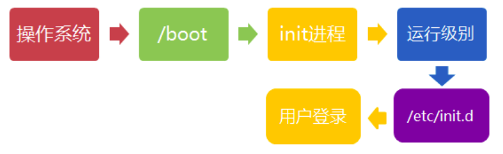
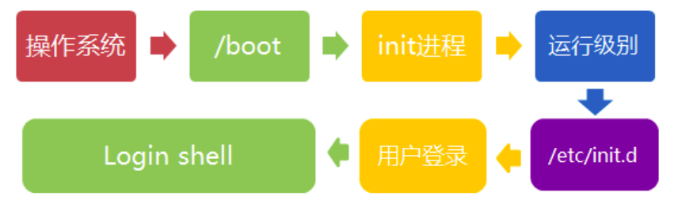

# Linux 系统的启动过程

- 内核的引导
- 运行 init
- 系统初始化
- 建立终端
- 用户登录系统

## 内核引导

当计算机打开电源后，首先是 BOIS 开机自检， 按照 BOIS 的中设置的启动设备来启动
操作系统首先进入 /boot


## 运行 init

init 是所有进程的源头，首先读取的文件是 /etc/inittab


### 运行级别

许多进程再开机的时候就启用，相当于 windows 的 service，在 linux 上叫做守护进程（daemon）

linux 在服务端需要在开机时启用 Apache，但是在个人用户端不需要，所以 linux 在启动时会分运行级别


::: tip 注意
linux 有七个运行级别：

1. 级别0：停机状态
2. 级别1：单用户工作状态，也就是在个人PC上使用的linux
3. 级别2：多用户状态(没有NFS)
4. 级别3：完全的多用户状态(有NFS)，登陆后进入控制台命令行模式
5. 级别4：系统未使用，保留
6. 级别5：X11控制台，登陆后进入图形GUI模式
7. 级别6：系统正常关闭并重启，默认运行级别不能设为6，否则不能正常启动
:::

## 系统初始化

它主要完成的工作有：激活交换分区，检查磁盘，加载硬件模块以及其它一些需要优先执行任务

会在命令行执行：`l5:5:wait:/etc/rc.d/rc 5`


## 建立终端

rc 执行完毕后会返回 init，这是系统环境基本配好，各种进程可以启动

init 接下来会打开6个终端

```shell script
1:2345:respawn:/sbin/mingetty tty1
2:2345:respawn:/sbin/mingetty tty2
3:2345:respawn:/sbin/mingetty tty3
4:2345:respawn:/sbin/mingetty tty4
5:2345:respawn:/sbin/mingetty tty5
6:2345:respawn:/sbin/mingetty tty6
```
## 用户登录系统

1. 命令行登录
2. ssh 登录
3. 图形界面登录



Linux 的账号验证程序是 login，login 会接收 mingetty 传来的用户名作为用户名参数

然后 login 会对用户名进行分析：如果用户名不是 root，且存在 /etc/nologin 文件，login 将输出 nologin 文件的内容，然后退出

### 图形模式与文字模式的切换方式

`Ctrl + Alt + F1 ~ F6` 进入六个在 init 开启的终端，如果想返回图形界面，`Ctrl + Alt + F7`



## Linux 关机

在 linux 服务器上很少遇到关机的情景，但是在个人PC端还是要关机的

正确的关机流程为：sync > shutdown > reboot > halt

```shell script
sync # 将数据由内存同步到硬盘中

shutdown # 关机指令 man shutdown 来查看关机指令的帮助文档

shutdown –h 10 ‘This server will shutdown after 10 mins’ # 这个命令告诉大家，计算机将在10分钟后关机，并且会显示在登陆用户的当前屏幕中。

shutdown –h now # 立马关机

shutdown –h 20:25 # 系统会在今天20:25关机

shutdown –h +10 # 十分钟后关机

shutdown –r now # 系统立马重启

shutdown –r +10 # 系统十分钟后重启

reboot # 就是重启，等同于 shutdown –r now

halt # 关闭系统，等同于shutdown –h now 和 poweroff
```
::: danger 危险
不管是重启系统还是关闭系统，首先要运行 sync 命令，把内存中的数据写到磁盘中
:::

## 参考文章

[阮一峰的博客](http://www.ruanyifeng.com/blog/2013/08/linux_boot_process.html)
