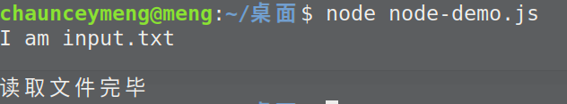

# Node.js 回调函数

Node.js 异步编程的直接体现就是回调

回调函数在完成任务后就会被调用，Node 使用了大量的回调函数，Node 所有 API 都支持回调函数

## 阻塞代码例子

```js
const fs = require('fs')
const data = fs.readFileSync('input.txt')

console.log(data.toString())

console.log('读取文件完毕')
```



## 非阻塞代码例子

```js
const fs = require('fs')
fs.readFile('input.txt',(err,data)=>{
  if(err) return console.log(err)
  console.log(data.toString())
})

console.log('读取文件完毕')
```


:::tip 注意
阻塞是按顺序执行的，而非阻塞是不需要按顺序的，所以如果需要处理回调函数的参数，我们就需要写在回调函数内
:::
