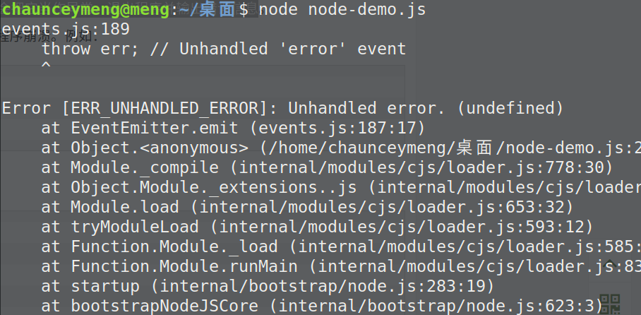

# Node.js EventEmitter

Node.js 所有的异步 I/O 操作在完成时都会发送一个事件到事件队列

## EventEmitter 类

events 模块只提供了一个对象： events.EventEmitter。EventEmitter 的核心就是事件触发与事件监听器功能的封装

>使用方法：
```js
const EventEmitter = require('events').EventEmitter; 
const event = new EventEmitter(); 
event.on('event', function() { 
    console.log('事件触发'); 
}); 
setTimeout(function() { 
    event.emit('event'); 
}, 1000);
```

EventEmitter 对象如果在实例化时发生错误，会触发 error 事件。当添加新的监听器时，newListener 事件会触发，当监听器被移除时，removeListener 事件被触发

事件名是一个字符串，通常表达一定的语义

## EventEmitter API

- addListener(event, listener)： 为指定事件添加一个监听器到监听器数组的尾部

- on(event, listener)：为指定事件注册一个监听器，接受一个字符串 event 和一个回调函数

- once(event, listener)：为指定事件注册一个单次监听器，即 监听器最多只会触发一次，触发后立刻解除该监听器

- removeListener(event, listener)：移除指定事件的某个监听器，监听器必须是该事件已经注册过的监听器

- removeAllListeners([event])： 移除所有事件的所有监听器， 如果指定事件，则移除指定事件的所有监听器

- setMaxListeners(n)： 默认情况下， EventEmitters 如果你添加的监听器超过 10 个就会输出警告信息。 setMaxListeners 函数用于提高监听器的默认限制的数量

- listeners(event)： 返回指定事件的监听器数组

- emit(event, [arg1], [arg2], [...])：按监听器的顺序执行执行每个监听器，如果事件有注册监听返回 true，否则返回 false


## Error 事件

我们在遇到 异常的时候通常会触发 error 事件

当 error 被触发时，EventEmitter 规定如果没有响 应的监听器，Node.js 会把它当作异常，退出程序并输出错误信息

```js
const event = require('events')
const emitter = new event.EventEmitter()
emitter.emit('error')
```


## EventEmitter 继承

在对象中继承它，包括 fs、net、 http 在内的，只要是支持事件响应的核心模块都是 EventEmitter 的子类