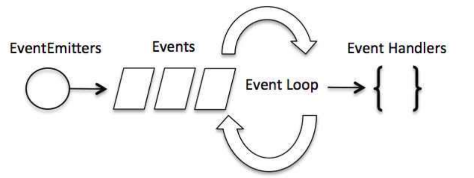

# Node.js 事件循环

Node.js 是单进程单线程应用程序，但是因为 V8 引擎提供的异步执行回调接口，通过这些接口可以处理大量的并发，所以性能非常高

Node.js 基本上所有的事件机制都是用设计模式中观察者模式实现

## 事件驱动程

Node.js 使用事件驱动模型，当web server接收到请求，就把它关闭然后进行处理，然后去服务下一个web请求

当这个请求完成，它被放回处理队列，当到达队列开头，这个结果被返回给用户

这个事件循环在[面试总结](/pages/interview-notes/open-questions.md#超纲题)里讲过，在这里就不赘述