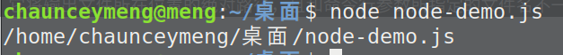

# Node.js 全局对象

JavaScript 中的全局对象是 window，而 Node.js 中的全局对象是 global

全局变量会挂在到全局对象上，但是最好不要用 var 声明变量，否则会造成全局污染

## __filename

**__filename** 表示当前正在执行的脚本的文件名

它将输出文件所在位置的绝对路径，且和命令行参数所指定的文件名不一定相同 

如果在模块中，返回的值是模块文件的路径

在 node-demo.js 里写:
```js
console.log(__filename)
```



## __dirname

__dirname 表示当前执行脚本所在的目录

在 node-demo.js 里写:
```js
console.log(__dirname)
```


## setTimeout(cb, ms)

**setTimeout(cb, ms)** 全局函数在指定的毫秒(ms)数后执行指定函数(cb)，只执行一次

```js
setTimeout(()=>{
  console.log('我是过了两秒执行的hello')
},2000)
console.log('我是立即执行的hello')
```


## console

console 用于提供控制台标准输出，它是由 Internet Explorer 的 JScript 引擎提供的调试工具，后来逐渐成为浏览器的实施标准

API：

- console.log([data][, ...])

>向标准输出流打印字符并以换行符结束

- console.info([data][, ...])

>该命令的作用是返回信息性消息该命令的作用是返回信息性消息，与 log 差别不大

- console.error([data][, ...])

>输出错误消息的

- console.warn([data][, ...])

>输出警告消息

- console.dir(obj[, options])

>用来对一个对象进行检查（inspect），并以易于阅读和打印的格式显示

- console.time(label)

>输出时间，表示计时开始

- console.timeEnd(label)

>输出时间，表示计时结束

- console.trace(message[, ...])

>当前执行的代码在堆栈中的调用路径

- console.assert(value[, message][, ...])

>用于判断某个表达式或变量是否为真，接收两个参数，第一个参数是表达式，第二个参数是字符串


## process

**process** 是一个全局变量，即 global 对象的属性

描述当前Node.js 进程状态的对象

API:
- **exit:** 当进程准备退出时触发

- **beforeExit:** 当 node 清空事件循环，并且没有其他安排时触发这个事件

- **uncaughtException:** 当一个异常冒泡回到事件循环，触发这个事件

- **Signal 事件:** 当进程接收到信号时就触发


