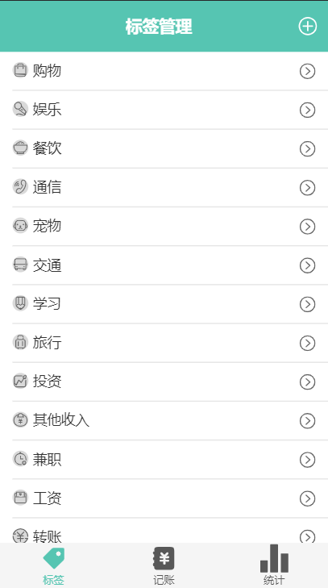

# 标签管理页面

## 本页面图片预览



## 功能板块

### 添加标签 


把所有的 svg 用 v-for 渲染到页面, 添加判断各种条件

### 修改/删除标签


input 事件来监听修改, $el.remove 来删除元素

## 遇到的问题

### 解决添加图标的时候, 因为数据结构是对象, 文字和 svg 在一起, 所以要解析对象去解析, 然后在把选中的 svg 和新的名字存到 localStorage

```vue
<template>
  <div>
    <div class="navBar">
      <Icon class="leftIcon" name="left" @click="goBack"/>
      <h3>新增标签</h3>
      <Icon name="success" @click="createTag" class="rightIcon"/>
    </div>
    <div class="tags">
      <ul class="current">
        <li :class="{selected: selectedTags.indexOf(tag)>=0}" @click="toggle(tag)" v-for="(tag,index) in tagList"
            :key="index">
          <Icon :name="tag"/>
        </li>
      </ul>
      <label class="inputLabel">标签名:<input @input="getTagName($event.target.value)" type="text" placeholder="输入你想要的标签名"></label>
    </div>
  </div>
</template>
```


### 处理只能选中一个标签的逻辑, 


```js
toggle(tag: string) {
  if(this.selectedTags.length>=1 && tag!==this.selectedTags[0]){
    return ;
  }
  if(this.selectedTags.indexOf(tag)>=0){
    this.selectedTags.splice(0, 1);
  }else{
    this.selectedTags.push(tag);
  }
}
```
