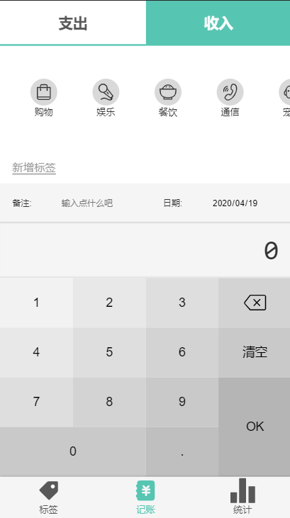

# money
 
小猫记账是一款简洁的记账网页应用

预览链接: 手机扫码体验更佳


源码链接: [https://gitee.com/chaunceym/moneyio](https://gitee.com/chaunceym/moneyio)

## 本页面预览图片 



## 功能板块

### 切换支出和收入

因为统计页面都用到了这样的分栏显示, 所以单独抽离出组件来共用(组件化)


### 标签滑动

利用 flex 实现横向滑动, 比较有动感, 而且左下角还有新增标签的方式, 会进入新增标签页面

### 备注和选择日期

填写备注选择日期来实现记账的额灵活性, 还是抽离了共用组件

### 记账面板

本页面的核心部分, 记账面板, 像是一个简单的计算器, 有清空和删除按钮

## 遇到的问题

### svg 的引入问题

因为本项目是 Vue + TypeScript 结合的项目, 所以需要配置 `vue.config.js` 而不是 `webpack.config.js
在引入 svg 的时候遇到了配置问题, 经过很长时间的搜索找出了以下代码

```js
const path = require('path');

module.exports = {
  publicPath: process.env.NODE_ENV === 'production'
    ? '/moneyio-website/'
    : '/',
  lintOnSave: false,
  chainWebpack: config => {
    const dir = path.resolve(__dirname, 'src/assets/icons');

    config.module
      .rule('svg-sprite')
      .test(/\.svg$/)
      .include.add(dir).end() // 包含 icons 目录
      .use('svg-sprite-loader').loader('svg-sprite-loader').options({extract: false}).end()
      .use('svgo-loader').loader('svgo-loader')
      .tap(options => ({...options, plugins: [{removeAttrs: {attrs: 'fill'}}]})).end()
    config.plugin('svg-sprite').use(require('svg-sprite-loader/plugin'), [{plainSprite: true}])
    config.module.rule('svg').exclude.add(dir) // 其他 svg loader 排除 icons 目录
  }
};
```

在 icon 组件里使用 svg, 直接引入 icons 文件夹自动引入写最长的两行代码就好 

```vue
<template>
    <svg class="icon" @click="$emit('click',$event)">
        <use :xlink:href="'#'+name"/>
    </svg>
</template>

<script lang="ts">
  const importAll = (requireContext: __WebpackModuleApi.RequireContext) => requireContext.keys().forEach(requireContext);
  try {importAll(require.context('../assets/icons', true, /\.svg$/));} catch (error) {console.log(error);}

  export default {
    props: ['name'],
    name: 'Icon'
  };
</script>

<style lang="scss" scoped>
    .icon {
        width: 1em; height: 1em;
        vertical-align: -0.15em;
        fill: currentColor;
        overflow: hidden;
    }
</style>
```

在这里记录下便于以后做其他项目时使用

还有就是 TypeScript 在 Vue 里的使用
1. 利用 `vue-property-decorator` (第三方库,比 Vue 原生好用)
2. 要用 class 来 extends Vue 导出组件
3. props 声明要用这种方式
   - ```vue
        @Prop({required: true, type: Array}) dataSource!: DateSourceItem[];
     ```
4. 引入组件要用这种方式
    - ```vue
        @Component({
        components: {Tabs, Tags, FormItem, NumberPad},
        })
      ```
