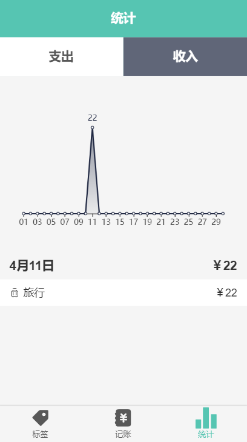

# statistic

## 本页预览图片

## 功能板块

### 切换支出和收入

利用了统一的组件, 只是改了样式和颜色

### Echarts 表格使用

在 Ts + Vue 里使用了 Echarts 
, 还

### 显示日期对应的昨天,今天,前天

运用了 day.js 处理了日期的转换, 还有记账后标签的渲染和记账总和的计算

## 遇到的问题

### Echart 及时渲染

在记账过后的数据对应及时渲染, 刚开始想的是钩子函数的时机渲染问题,
后来搜索半天没有解决, 换了个思路是否是 Echars 的问题,
因此找到了我想要的答案, 我还写了[一篇博客](https://zhuanlan.zhihu.com/p/114415715)来加深记忆

