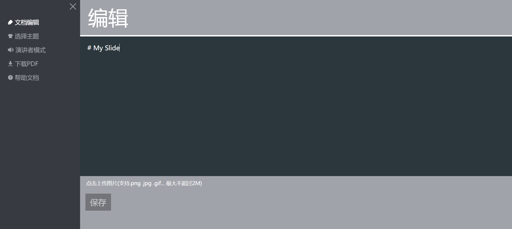
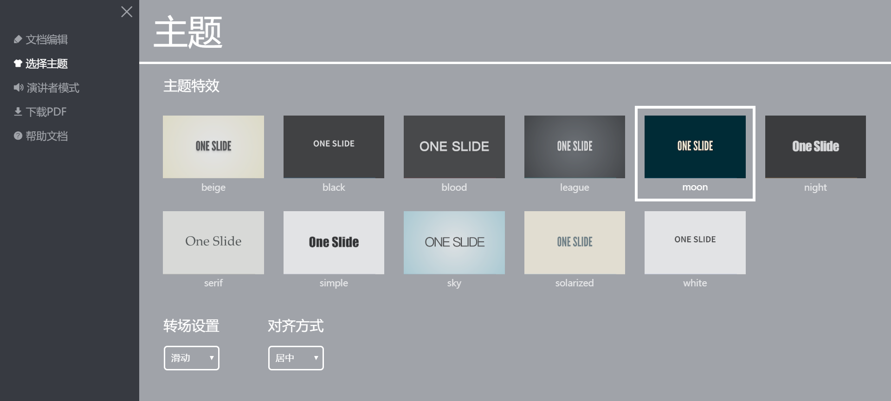
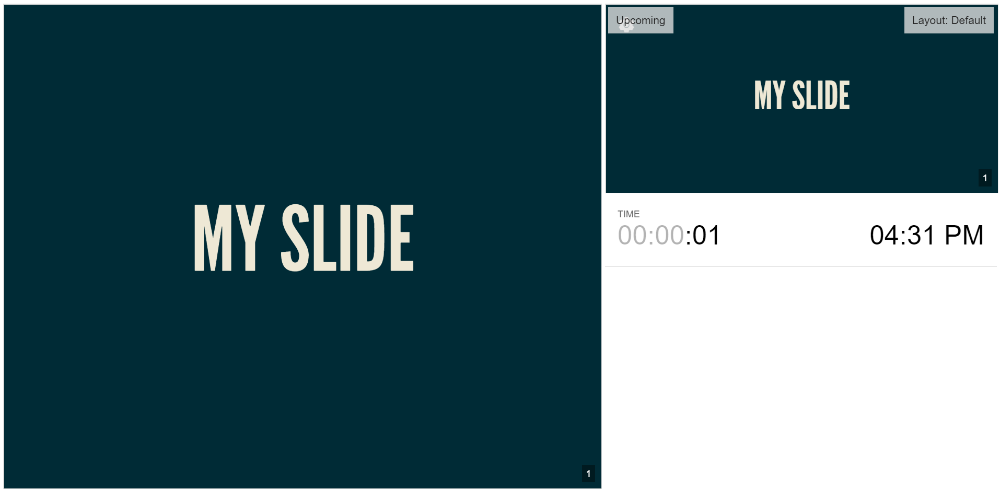
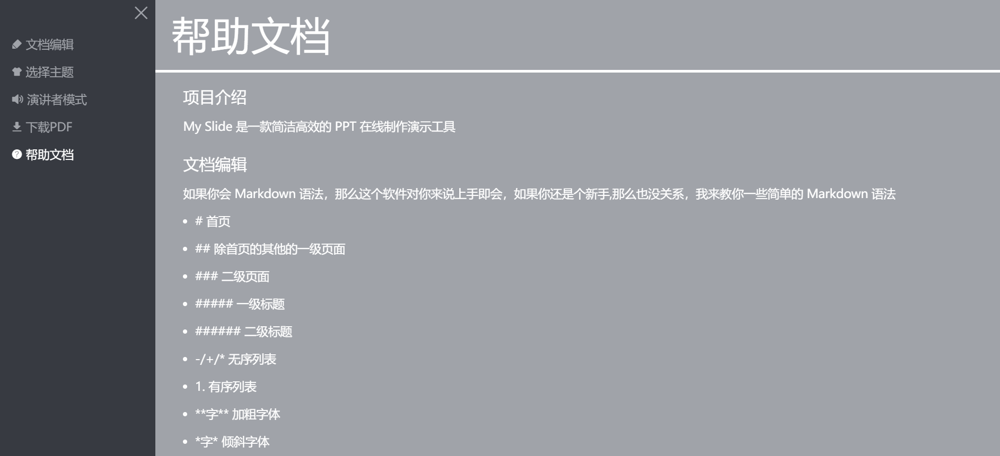

# My Slide

My Slide 是一款简洁的制作 PPT 的网页应用(基于 reveal.js)


预览链接: [https://chaunceym.gitee.io/myslide/](https://chaunceym.gitee.io/myslide/)

源码链接: [https://gitee.com/chaunceym/myslide](https://gitee.com/chaunceym/myslide)

## 功能板块

### 文档编辑



使用 markdown 语法就可完成的多页展示和标题选择

### 选择主题



多种主体和布局可选

### 演讲者模式
 


转为演讲者设计, 可预览下一张内容, 还可添加笔记在 PPT 上(只有演讲者可见), 还可查看时间

### 下载 PDF


可以下到到本地 PDF, 方便存储

### 帮助文档



如何使用本项目, 都写在这里了, 你读一遍就能上手了


## 遇到的问题

本项目用原生 JS 编写, 但运用模块化思想, 代码很简洁舒服


举个例子:
```js
const Menu = {
  init() {
    this.$settingIcon = $('.control .icon-setting')
    this.$menu = $('.menu')
    this.$closeIcon = $('.menu .icon-close')
    this.$$tabs = $$('.menu .tab')
    this.$$contents = $$('.menu .content')
    this.bind()
  },

  bind() {
    this.$settingIcon.onclick = () => {
      this.$menu.classList.add('open')
    }
    this.$closeIcon.onclick = () => {
      this.$menu.classList.remove('open')
    }
    this.$$tabs.forEach(($tab, index) => $tab.onclick = () => {
      this.$$tabs.forEach($tab => $tab.classList.remove('active'))
      $tab.classList.add('active')
      this.$$contents.forEach($content => $content.classList.remove('active'))
      this.$$contents[index].classList.add('active')
    })
  }
}

App.init(Menu) // 初始化
```

把所有的数据都存储在本地, 读取快捷, 数据一般不会丢失


