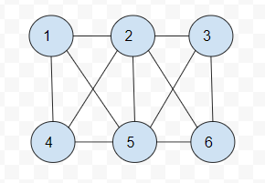

# 图和图算法

## 图的定义

图是由边的集合和顶点的集合组成, 如果一个图的顶点是有序的, 则称之为有向图, 有向图表明了图的流向, 与流程图类似


**有向图**



**无向图**


图中的一系列顶点构成路径, 路径所有的顶点都由边连接, 路径长度用路径第一个顶点到最后一个顶点之间的边的数量表示

圈是至少有一条边的路径, 且路径的第一个顶点和最后一个顶点相同

## 构建图

用二维数组来构建, 每个顶点和其他顶点的联系去构建二维数组

```js
function Graph(v) {
  this.vertices = v
  this.edges = 0
  this.adj = []
  for(let i = 0; i < this.vertices; i++) {
    this.adj[i] = []
    this.adj[i].push("")
  }
  this.addEdge = addEdge
  this.toString = toString
}
```

这个类会记录一个图表示了多少条边, 并使用一个长度与图的顶点数相同的数组来记录顶点的数量, 通过 for 循环为数组中每个元素
添加一个子数组来存储所有的相邻顶点, 并将所有元素初始化为空字符串

>添加图

```js
function addEdge(v,w) {
  this.adj[v].push(w)
  this.adj[w].push(v)
  this.edges++ 
}
```

>显示图

```js
function showGraph() {
  for(let i = 0; i < this.vertices; i++) {
    console.log(`${i} => `) 
    for(let j=0;j<this.vertices;j++){
      if(this.adj[i][j] !== undefined){ 
        console.log(this.adj[i][j] + '') 
      } 
    } 
  }
}
```

## 搜索图

### 深度优先搜索

深度优先搜索是一个不断回溯的过程

访问一个没有访问过得顶点, 将它标记为已访问, 在递归访问在原始顶点的领接表中其他没有访问的顶点

```js
function dfs(v) {
  this.marked[v] = true
  if(this.adj[v] !== undefined){
    for(let w in this.adj[v]){
      if(!this.marked[v]){
        this.dfs[w] 
      } 
    } 
  }
}
```

### 广度优先搜索

广度优先搜索算法使用了抽象的队列而不是数组来对以访问的顶点排序

具体步骤:

1. 查找与当前顶点相邻的未访问顶点, 将其添加到已访问顶点的列表及队列中
2. 从图中取出下一个顶点 v, 添加到已访问的节点列表
3. 将所有与 v 相邻的未访问顶点都添加到队列

```js
function bfs(s) {
 let queue = [] 
 this.marked[s] = true
 queue.push(s)
 while(queue.length > 0){
  let v = queue.shift()
  if(this.adj[v] !== undefined){
    console.log(`Visisted vertex ${v}`) 
  } 
  for(let w in this.adj[v]){
    if(!this.marked[w]){
      this.marked[w] = true
      queue.push(w) 
    } 
  }
 }
}
``` 