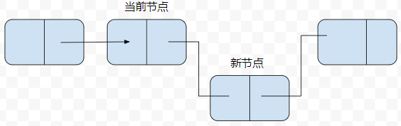
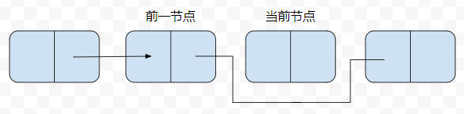

# 链表

数组结构有其缺点, 在数组中添加和删除元素很麻烦, 因为这样会将数组的元素整体向后平移, 然而 JS 中不存在这样的问题, 使用 splice() 方法
就可以实现添加删除和修改, 但是也正因为这样, JS 的数组运行效率相对于其他语言来说效率很低, 所以在适当的时候可以选择链表来进行替代

## 定义链表

链表是由一组节点组成的集合, 每个节点都使用一个对象的引用指向它的后继

数组靠它们的位置进行引用, 链表元素靠的是相互之间的关系进行引用

链表中插入一个节点的效率很高, 向链表中插入一个节点, 需要修改它前面的节点, 使其指向新加入的节点, 而新加入的节点则指向原来前驱指向的节点

## 设计一个基于对象的链表

>我们设计的链表包含两个类, Node 类用来表示节点, LinkedList 用来提供了插入节点, 删除节点等方法

### Node 类

element 用来保存节点的数据, next 用来保存指向下一个节点的链接

```js
function Node(element){
  this.element = element
  this.next = null
}
```

### LinkedList 类

```js
function LinkedList(){
  this.head = new Node('head')
  this.find = find 
  this.insert = insert 
  this.remove = remove 
  this.display = display 
}
```

## 插入新节点

向链表中插入新节点时, 需要指明在那个节点前或后插入

1. 如何在一个已知节点后插入

当在后面插入时, 当然先得找到当前节点的 next 指向哪个节点

所以我们现在完成 find() 方法来寻找节点

```js
function find(item){
  let currNode = this.head
  while(currNode.element !== item){
    currNode = currNode.next 
  }
  return currNode
}
```

找到匹配的节点, 就可以插入新的节点了

```js
function insert(newElement,item) {
  let newNode = new Node(newElement) 
  let current = this.find(item)
  newNode.next = current.next
  current.next = newNode
}
```

这里的逻辑有点抽象, 就是把当前节点的 next 赋值给新插入的节点的 next, 然后把当前节点在赋值给当前节点的 next, 这样就算是插入了一个新节点



定义展示链表方法

```js
function display(){
  let currNode = this.head
  while(!(currNode.next === null)){
    console.log(currNode.next.element) 
    currNode = currNode.next
  }
}
```

测试链表方法

```js
let cities = new LinkedList()
cities.insert('meng','head')
cities.insert('xiang','meng')
cities.insert('yu','xiang')
cities.display() // "meng" "xiang" "yu"
```

## 删除一个节点

从链表中删除一个节点首先要找到待删除节点的前一个节点, 然后让前一个节点的 next 指向待删除节点的后一个节点, 就完成了删除

为了找到前一个节点, 所以我们定义一个 findPrevious() 方法来找到前一个节点

```js
function findPrevious(item){
  let currNode = this.head
  while(!(currNode.next === null) && (currNode.next.element !== item)){
    currNode = currNode.next 
  }
  return currNode
}
``` 

从头结点开始遍历链表, 当前节点的 next 不为空或者不等于要查询节点的 element 的时候, 继续循环, 否则就返回

下面就可以开始写 remove() 方法, 如果当前节点的前一节点的 next 不为空, 那么就直接把前一节点的 next 指向当前节点的后一节点

```js
function remove(item){
  let prevNode = this.findPrevious(item)
  if(!(prevNode.next === null)){
    prevNode.next = prevNode.next.next 
  }
}
```



## 双向链表

单项链表从前到后遍历很简单, 但是如果从后往前遍历就很难, 这时候就可以给 Node 对象加一个属性, 改属性指向前驱节点的连接, 
这样的链表就叫双向链表

定义 Node 类

```js
function Node(element){
  this.element = element 
  this.next = null 
  this.previous = null 
}
```

双向链表的 insert() 方法

```js
function insert(newElement,item){
  let newNode = new Node(newElement)
  let current = this.find(item)
  newNode.next = current.next
  newNode.previous = current
  current.next = newNode
}
```

双向链表的 remove() 方法, 不需要遍历所有节点, 只需要找到当前的节点, 然后把前节点的 next 改为后节点, 然后再把后节点的 previous 改为
前节点就好了

```js
function remove(item){
  let currNode = this.find(item)
  if(currNode.next !== null){
    currNode.previous.next = currNode.next 
    currNode.next.previous = currNode.previous
    currNode.next = null 
    currNode.previous = null 
  }
}
```

为了满足显示反序链表中元素这类需求, 添加一个工具方法

```js
function findLast(){
  let currNode = this.head
  while(currNode!==null){
    currNode = currNode.next 
  }
  return currNode
}
```

有了这个方法就可以反序显示链表

```js
function disReverse(){
  let currNode = this.findLast()
  while(currNode.previous !== null){
    console.log(currNode.element) 
    currNode = currNode.previous
  }
}
```

## 循环链表

循环链表和单项链表类似, 唯一区别就是在声明头结点时把 next 指向本身 head.next = head

```js
function LinkedList(){
  this.head = new Node('head')
  this.head.next = head
  this.find = find
  this.insert = insert
  this.display = display
}
```

这时候 display 就必须变化一下, 否则会成死循环

```js
function display(){
  let currNode = this.head
  while(currNode.next !== null && currNode.next.element !== 'head'){
    console.log(currNode.next.element) 
    currNode = currNode.next
  }
}
```