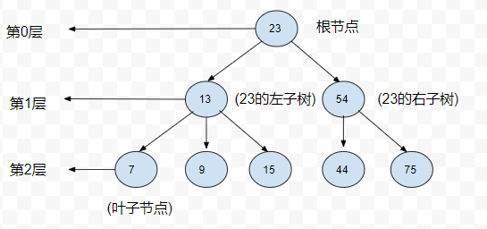

# 二叉树和二叉查找树

树是计算机科学中经常用到的一种数据结构, 树是一种非线性的数据结构, 以分层的方式存储数据

二叉树弥补了数组添加和删除元素的弊端, 也弥补了链表查找元素的弊端, 树查找数据和添加数据都很有效率

## 树的定义



上图就为树的基本结构, 最上面的节点为根节点, 如果一个节点下面有更多的连接节点, 那么该节点就为父节点, 下面的节点就为子节点,
没有任何子节点的节点为叶子结点

树可以被分为几个层次, 根节点是第0层, 它的子节点是1层, 以此类推, 我们定义的层数就是树的深度

## 二叉树与二叉查找树

二叉树是一种特殊的树, 它的每个子节点不允许超过两个, 通过将子节点个数限定为2, 可以写出高效的程序在树中插入, 查找和删除数据

>相对于二叉树中的二叉查找树, 确定子节点非常重要, 相对于较小的值保存在左节点中, 较大的值保存在右节点中, 这样大大提高了查找的效率

### 实现二叉查找树

实现 Node 类

```js
function Node(data,left,right){
  this.data = data
  this.left = left
  this.right = right
  this.show = show
}
function show() {
  return this.data
}
```

实现 BST(Binary Search Tree) 类

```js
function BST() {
 this.root = null
 this.insert = insert 
 this.inOrder = inOrder
}
function insert(data){
  let n = new Node(data,null,null)
  if(this.root === null){
    this.root = n    
  }else{
    let current = this.root
    let parent
    while(true){
      parent = current 
      if(data < current.data){
        current = current.left 
        if(current === null){
          parent.left = n 
          break
        }
      }else{
        current = current.right 
        if(current === null){
          parent.right = n 
          break
        }
      }
    } 
  }
}
```

`insert()` 方法原理: 
1. 设置根节点为当前节点
2. 如果待插入节点保存的数据小于当前节点, 则设新的当前节点为源节点的左节点, 反之执行第四部
3. 如果当前节点的左节点为null, 那么将新的节点插入到当前位置, 退出循环, 反之执行下一次循环
4. 设当前节点为源节点的右节点
5. 如果当前节点的右节点为null, 那么将新的节点插入到当前位置, 退出循环, 反之执行下一次循环

### 遍历二叉查找树

有三种遍历 BST 的方式: 
1. 中序: 左根右
2. 先序: 根左右
1. 后序: 左右根

>中序遍历的实现

```js
function inOrder(node){
  if(node !== null){
    return [...inOrder(node.left),node.data,...inOrder(node.right)]
  }else{
    return [] 
  }
}
```

>先序遍历的实现

```js
function preOrder(node){
  if(node !== null){
    return [node.data,...preOrder(node.left),...preOrder(node.right)]
  }else{
    return [] 
  }
}
```

>后序遍历的实现

```js
function postOrder(node){
  if(node !== null){
    return [...postOrder(node.left),...postOrder(node.right),node.data]
  }else{
    return [] 
  }
}
```

### 在二叉查找树上进行查找

>最大值

```js
function getMin() {
  let current = this.root 
  while(current.left !== null){
    current = current.left 
  }
  return current.data
}
```
>最大值

```js
function getMax() {
  let current = this.root 
  while(current.right !== null){
    current = current.right 
  }
  return current.data
}
```

>给定值

```js
function find(data) {
  let current = this.root
  while(current !== null){
    if(current.data === data){
      return current 
    }else if(data < current.data){
      current = current.left 
    } else if(data > current.data){
      current = current.right 
    } 
  }
  return null
}
```

### 从二叉树上实现删除节点

```js
function remove(data) {
  root = removeNode(this.root,data)
}
function removeNode(node,data) {
  if(node === null){
    return null 
  } 
  if(node.data === node.data){
    if(node.left === null && node.right === null){
      return null 
    } 
    if(node.left === null){
      return node.right 
    }
    if(node.right === null){
      return node.left 
    }
    let tempNode = Math.min(node.right.data)
    node.data = tempNode.data
    node.right = removeNode(node.right,tempNode.data)
    return node
  }else if(data < node.data){
    node.left = removeNode(node.left,data) 
    return node
  }else{
    node.right = removeNode(node.right,data) 
    return node
  }
}
```
